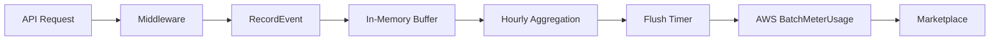

# Metering & Billing

## Overview

GoAL3 includes built-in cloud marketplace metering that tracks vCPU usage for AWS Marketplace billing. The metering system automatically records processing time and vCPU allocation for each AL3 transaction, enabling usage-based pricing.

---

## Pricing Model

### vCPU-Hour Billing

- **Unit**: vCPU-hours (rounded up to next full hour)
- **Price**: $0.40 per vCPU-hour
- **Calculation**: Processing Time (seconds) × vCPU Count / 3600
- **Minimum Charge**: 1 vCPU-hour per transaction period

### Free Tier

- **Duration**: 14 days from first deployment
- **Limit**: Single vCPU, single replica
- **Purpose**: Integration testing andpoc evaluation

---

## Configuration

###Environment Variables

| Variable | Description | Required | Default | Example |
|----------|-------------|----------|---------|---------|
| `METERING_ENABLED` | Enable/disable metering | No | `true` | `true` |
| `METERING_PROVIDER` | Metering provider (`aws`, `noop`) | No | `aws` | `aws` |
| `AWS_REGION` | AWS region for marketplace | Yes (AWS) | - | `us-east-1` |
| `PRODUCT_CODE` | AWS Marketplace product code | Yes (AWS) | - | `abc123xyz` |
| `METERING_FLUSH_INTERVAL` | Flush interval for aggregation | No | `1h` | `30m` |

### AWS Credentials

The AWS metering client uses the standard AWS SDK credential chain:

1. **Environment variables**: `AWS_ACCESS_KEY_ID`, `AWS_SECRET_ACCESS_KEY`
2. **IAM Role** (recommended for EKS/EC2): Attach IAM role with `aws-marketplace:BatchMeterUsage` permission
3. **Shared credentials file**: `~/.aws/credentials`

### IAM Policy Example

```json
{
  "Version": "2012-10-17",
  "Statement": [
    {
      "Effect": "Allow",
      "Action": [
        "aws-marketplace:BatchMeterUsage"
      ],
      "Resource": "*"
    }
  ]
}
```

---

## Usage

### API Server Metering

The API server automatically records metering events for each `/v1/parse` and `/v1/validate` request:

```go
// API server automatically creates metering collector
collector := metering.NewCollector(
    metering.NewAWSMeter(ctx, productCode, region),
    1*time.Hour,  // Flush interval
    logger,
)

// Start background flush loop
collector.Start(ctx)

// Events are automatically recorded by middleware
// No manual instrumentation required
```

**Metering data captured per request:**
- Customer ID (from request headers or IP)
- Processing time (milliseconds)
- vCPU count (auto-detected from container limits)
- Data size (AL3 file size in bytes)
- Timestamp

### Batch Processing Metering

Batch jobs record metering events per processed file:

```go
// Batch processor records event for each file
processor.ProcessBatch(ctx)  // Metering happens automatically
```

**Aggregation**: Events are aggregated hourly per customer before being sent to AWS Marketplace.

---

## Monitoring

### Metering Logs

Metering events are logged at `INFO` level:

```json
{
  "level": "INFO",
  "msg": "flushing metering records",
  "count": 15,
  "meter": "aws"
}
```

### Flush Behavior

- **Automatic**: Background goroutine flushes every `METERING_FLUSH_INTERVAL`
- **On Shutdown**: Final flush on graceful shutdown
- **Batching**: AWS API batches up to 25 records per call

### Error Handling

If metering flush fails:
- Error is logged (does not fail the request)
- Unprocessed records are reported
- Retry logic handled by AWS SDK

---

## Development & Testing

### Disable Metering for Local Development

```bash
export METERING_ENABLED=false
```

Or use the no-op collector:

```bash
export METERING_PROVIDER=noop
```

### Testing with Mock Collector

```go
import "github.com/priyaiosystems/goal3/pkg/metering"

// Use no-op collector for unit tests
collector := metering.NewNoopCollector()
server := api.NewServer(config, logger, collector)
```

---

## Architecture

### Components

1. **MeteringCollector**: Aggregates events in-memory, hourly per customer
2. **AWSMeter**: Sends batched usage records to AWS Marketplace API
3. **NoopMeter**: Test/development stub (no-op)

### Data Flow



### Thread Safety

- **RecordEvent**: Thread-safe (uses mutex)
- **Flush**: Thread-safe (swaps buffer atomically)
- **Concurrent events**: Supported (tested with 100+ concurrent goroutines)

---

## Troubleshooting

### Issue: Metering events not appearing in AWS

**Check**:
1. Verify `AWS_REGION` matches marketplace registration
2. Confirm IAM role has `aws-marketplace:BatchMeterUsage` permission
3. Check logs for flush errors
4. Ensure `PRODUCT_CODE` is correct

### Issue: High metering costs

**Review**:
1. vCPU allocation (reduce if over-provisioned)
2. Processing time per transaction (optimize parser if needed)
3. Flush interval (longer intervals reduce API calls but don't affect billing)

### Issue: Unprocessed records

If AWS returns unprocessed records:
- Check for duplicate customer IDs in same batch
- Verify timestamp is not in the future
- Ensure dimension (`vCPU-hours`) is registered in marketplace

---

## Best Practices

1. **Use IAM Roles**: Avoid hard-coded credentials
2. **Monitor Flush Errors**: Set up alerts for metering failures
3. **Test with NoopCollector**: Use in CI/CD to avoid test charges
4. **Right-size vCPUs**: Allocate based on actual workload, not peak

---

For marketplace setup, see [`docs/deployment/aws_marketplace.md`](../deployment/aws_marketplace.md).
