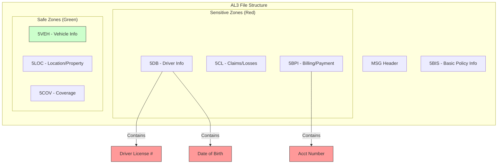
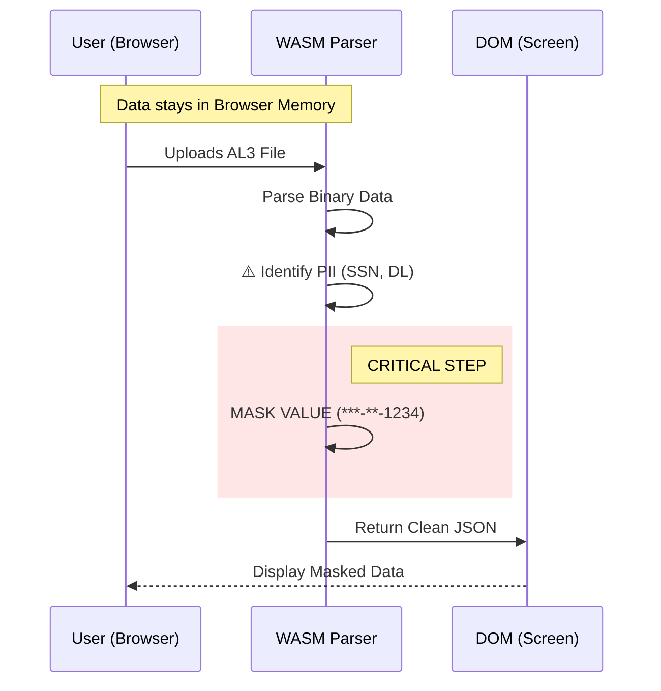

### TL;DR

Yes. In the context of Insurance Data (ACORD AL3), you must also mask **Driver's License Numbers** and **Bank Information**.

You should treat PII in three tiers: **Mask Always**, **Mask Partially**, and **Display Openly**.

---

### The PII Hierarchy for Insurance Data

Since this is a utility tool for professionals to verify data, you cannot mask everything (or they can't verify the policy). You must balance **Security** vs. **Utility**.

#### 1. Tier 1: The "Identity Theft" Set (MASK ALWAYS)

These fields, combined with a name, allow for immediate financial fraud.

* **Driver's License Number (DL):** Critical. Often found in the Driver (5DRV) group.
* **Bank Account / Routing Numbers:** Found if the AL3 includes billing or EFT data.
* **Medical/Health Info:** If the file is Life or Workers' Comp, any medical codes or notes are strictly regulated (HIPAA).

#### 2. Tier 2: The "Verification" Set (MASK PARTIALLY)

Users need to verify these exist, but don't need the full precision visually.

* **Date of Birth (DOB):** Mask the Day/Month, show the Year. (e.g., `**/**/1982`).
* *Why:* Age is a rating factor; agents need to verify the age, not the birthday.


* **Email / Phone:** Consider masking the middle characters (e.g., `j****@gmail.com`).

#### 3. Tier 3: The "Business" Set (DISPLAY OPENLY)

Do not mask these, or your tool becomes useless for checking policy downloads.

* **First/Last Name:** Essential to know *who* the policy belongs to.
* **Address:** Essential for Property insurance verification.
* **VIN (Vehicle Identification Number):** Essential for Auto insurance verification.
* **Policy Number:** The primary key for the transaction.

---

### Visual Guide: The AL3 PII Radar

This diagram shows which segments usually contain the data you need to target in your Go parser.



### Technical Recommendation: The "Redact" Struct tag

Since you are using Go, you can use struct tags to handle this cleanly in your parser.

```go
type Driver struct {
    Name       string `al3:"name" json:"name"`
    LicenseNum string `al3:"dl_num" json:"dl_num" pii:"mask"`  // Tagged for masking
    DOB        string `al3:"dob"    json:"dob"    pii:"year"`  // Tagged for partial
}

```

## Handling PII (SSN) in WASM Viewer

Even though the parsing happens locally in the user's browser (client-side), you **must mask SSN** (and other PII like Driver's License numbers) in the UI. 

**Note:** SSN data elements are designated using `SSNO` Ref ID.

* **Reason 1: "Shoulder Surfing":** Users often open viewers in offices or on shared screens. Displaying full SSNs creates a massive privacy leak risk for *them*.
* **Reason 2: Liability:** If your tool is seen "displaying" SSNs casually, enterprise users (your potential AWS customers) will block it immediately due to compliance fears (SOC2, HIPAA).

---

### The Two Levels of Safety

Since your architecture is **Client-Side WASM**, you have a unique advantage, but you must implement it correctly.

#### 1. The "True" Privacy (Architecture)

Because you aren't uploading the file to a server, the **Raw SSN** never leaves the user's computer. This is your biggest selling point.

* *You* don't see it.
* *GitHub Pages* doesn't see it.
* Only the *User* has it.

#### 2. The "Visual" Privacy (UI)

You still need to protect the user from accidental exposure on their own screen.

### Visual Guide: Where to Mask

This diagram shows the flow of data. Since the Raw Data exists in the browser memory, your WASM parser acts as the "Filter" before the UI renders anything.



### Recommended Implementation (The "Toggle" Pattern)

Do not delete the data; just hide it by default.

1. **Default State:** Mask all SSNs (`***-**-6789`).
2. **The "Eye" Icon:** Add a "Show/Hide" toggle button next to the field.
3. **Warning:** If they click "Show", pop a small browser toast/tooltip: *"Warning: PII visible."*

This approach balances **Utility** (checking if the SSN is correct) with **Safety** (preventing accidental screenshots).