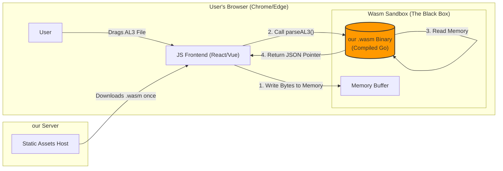

# PRD: ACORD AL3 Web Viewer (Free Tier)

| **Version** | 1.0 (MVP) |
| --- | --- |
| **Status** | Draft |
| **Owner** | Priya IO Systems |
| **Primary Goal** | Demonstrate parsing accuracy to build trust and generate leads for the Enterprise Sidecar Container. |
| **Key Constraint** | **Zero-Trust Privacy:** All parsing must happen client-side (Browser) via WebAssembly. No data uploads. |





---

## 1. Problem & Opportunity

* **The Problem:** Insurance Data Engineers have no easy way to inspect legacy AL3 files without expensive proprietary software. They cannot verify if a parsing solution works without a lengthy POC.
* **The Solution:** A free, browser-based utility that instantly visualizes AL3 structure and converts it to JSON.
* **The Hook:** "See our data instantly. Keep our data private. Automate the rest with our Sidecar."

---

## 2. Target Persona

* **Primary:** **Data Engineer / ETL Developer** at an Insurance Carrier or Agency.
* *Behavior:* Technical, skeptical of sales calls, prefers "self-serve" tools, cares about data privacy.


* **Secondary:** **Business Analyst** trying to debug why a policy failed to import.

---

## 3. Functional Requirements

### 3.1 Input Mechanism

* **Drag & Drop Zone:** Prominent area to drop `.al3` or `.dat` files.
* **File Validation:**
* Check for AL3 headers immediately.
* **Restriction:** Limit file size to **5MB** (Browser memory safety). Show error: *"For large batch processing (>5MB), please use our Sidecar Container."*


### 3.2 Parsing Engine (The Wasm "Black Box")

* **Technology:** compiled **Go (TinyGo)** to WebAssembly (`.wasm`).
* **Logic:**
* Parse the AL3 hierarchy (Transaction -> Groups -> Elements).
* **IP Protection ("Lite Mode"):**
* Include full parsing for standard ACORD groups.
* *Optional:* Exclude proprietary/custom vendor extensions (like Vertafore/Applied custom groups) to encourage paid upgrades for "Full Compliance."


### 3.3 Visualization (The 2-Pane UI)

* **Left Pane (Hierarchy Tree):**
* Display the logical structure: `Message` -> `Transaction (2MEM)` -> `Line of Business (5LOB)` -> `Driver/Vehicle Groups`.
* Allow expanding/collapsing nodes.


* **Right Pane (Data Grid):**
* When a node (Group) is clicked in the left pane, show its data elements in a grid.
* **Columns:** `Element Code` | `Description` | `Raw Value` | `Parsed Value`.
* *Example:* Code: `5LOB01` | Desc: `Line of Business` | Value: `AUT`


### 3.4 The "JSON Preview" (The Developer Hook)

* **Action:** A generic **"View JSON"** button / toggle.
* **Display:** Show the hierarchical JSON output of the parsed file in a syntax-highlighted editor (read-only).
* **Copy:** "Copy to Clipboard" button.

---

## 4. Non-Functional Requirements

### 4.1 Security & Privacy

* **Client-Side Only:** Network tab must show **0 requests** sending AL3 data to any server.
* **Sandbox:** The Wasm module must run in strict isolation.

### 4.2 Performance

* **Load Time:** The Web App (React/Vue + Wasm) must load in **< 2 seconds** on 4G.
* **Parse Speed:** Parsing a 500KB AL3 file must take **< 500ms**.

### 4.3 Reliability

* **Error Handling:** If a file is malformed, display a friendly error: *"Invalid AL3 Structure at Line 45. This file may be corrupted."* (Do not crash the browser tab).

---

## 5. UI/UX Wireframe Description

**Header:**

* Logo: **GraphLens**
* Right Corner: **[ Get Enterprise Sidecar ]** (Primary CTA Button - Gold/Blue color)

**Main Body:**

* **State A (Empty):**
* Large centered drop zone.
* Text: *"Drag & Drop ACORD AL3 file here."*
* Subtext: *"100% Private. Parsing happens locally in our browser."*


* **State B (File Loaded):**
* **Toolbar:** File Name (`policy_123.al3`) | [Reset] | [View JSON Toggle]
* **Split Screen Lawet:**
* **Left (30% width):** Tree View (Scrollable).
* **Right (70% width):** Data Grid (Sortable).


**Footer:**

* Sticky Banner: *"Parsing 1 file is easy. Need to parse 10 million? Deploy our AWS Sidecar ->"*

---

## 6. Implementation Strategy (The "Go" Build)

### 6.1 The "Lite" Build Tags

we will maintain a single codebase but use build tags to exclude heavy enterprise features from the Wasm build.

**File Structure:**

```text
/parser
  ├── common.go       (Shared logic)
  ├── definitions.go  (Standard ACORD definitions)
  ├── advanced.go     (Complex logic - //go:build !wasm)
  └── advanced_stub.go (Empty stubs - //go:build wasm)

```

**Stub Example (`advanced_stub.go`):**

```go
//go:build wasm
package parser

func ParseProprietaryExtensions(data []byte) (Result, error) {
    return Result{}, nil // Simply ignore custom extensions in free tier
}

```

### 6.2 The Frontend Stack

* **Framework:** React (Vite) or Vue 3.
* **Tree Component:** `react-arborist` or `rc-tree` (High performance for deep nesting).
* **Grid Component:** `ag-grid-community` (Industry standard for data grids).
* **Wasm Bridge:** Copy `wasm_exec.js` from our Go root.

## 7. Freemium Strategy

We want to prove **Competence** (that we can parse the complex binary structure) without giving away **Utility** (the actual data extraction for production work).

With 146 Groups and 21 LOBs, the **"Full Structure, Limited Data"** strategy is our best move.

### **The Recommended Lite Strategy: "See the Tree, Lock the Fruit"**

Don't just delete groups. If a user uploads a Commercial Package Policy and sees "Unknown Group" or a blank screen, they will think our parser is broken. They need to see that we *understood* the file, even if we don't show them the values.

#### **1. The "Green List" (Fully Visible)**

* **What:** The "Envelope" and one "Hero" LOB.
* **Logic:** These groups prove we can handle the basic ACORD standard headers and metadata.
* **Groups to Include:**
* **Headers:** `1MSG` (Message), `2MEM` (Transaction).
* **Common Policy:** `5BPI` (Basic Policy Info), `5BIS` (Basic Insured), `5LOB` (Line of Business).
* **The "Hero" LOB (Personal Auto):** `6VEH` (Vehicle), `6DRV` (Driver), `6CVG` (Coverages).


* **Why Personal Auto?** It is the "Hello World" of insurance. Every data engineer knows what a VIN and a Driver Name look like. If we parse this perfectly, we pass the "Smell Test."

#### **2. The "Yellow List" (Structure Only - The "Upsell" Zone)**

* **What:** The other 20 LOBs (Workers Comp, GL, Property, etc.) and complex ratings.
* **Logic:** Show the **Hierarchy Tree** (Left Pane) fully, but **Mask the Data** (Right Pane).
* **Behavior:**
* *Left Pane:* User sees `6WCR` (Workers Comp Rating) correctly nested under the LOB. **This proves our offset parsing logic is perfect.**
* *Right Pane:* When they click it, show the *Field Names* (e.g., "Class Code", "Rate") but replace the *Values* with `<Enterprise Edition>` or `****`.


* **The Psychological Hook:** "We successfully parsed this complex Commercial group. Unlock the sidecar to see the data."

#### **3. The "Red List" (Excluded / Hidden)**

* **What:** Vendor Extensions (Proprietary fields).
* **Groups:** Any group starting with `9` (e.g., `9AMS` for AMS360, `9VRT` for Vertafore).
* **Logic:** These are often non-standard and high-IP. Hiding them protects our deepest "secret sauce" for handling edge cases.

---

### **Implementation Guide for Wasm ("Lite" Build)**

Here is how we code this restriction into our `advanced_stub.go` (Wasm version) so it happens automatically.

```go
//go:build wasm
package parser

import "strings"

// Define the "Hero" LOBs that are free to view
var freeLOBs = map[string]bool{
    "AUTO": true, // Personal Auto
    "HOME": true, // Homeowners
}

// MaskData decides whether to show the real value or a marketing placeholder
// lobCode: The LOB code from the 5LOB group (e.g., "AUT", "WCP")
func MaskData(lobCode string, groupName string, rawValue string) string {
    // 1. Always show Envelope Groups (Headers)
    if strings.HasPrefix(groupName, "1") || 
       strings.HasPrefix(groupName, "2") || 
       strings.HasPrefix(groupName, "5") {
        return rawValue
    }

    // 2. Allow Hero LOBs (Auto/Home)
    if freeLOBs[lobCode] {
        return rawValue
    }

    // 3. Mask everything else (The Upsell)
    return "🔒 Enterprise Only"
}

```

### **Summary of the "GoAL3 Lite" Viewer Experience**

| Feature | **User Experience** | **What it Proves** |
| --- | --- | --- |
| **Tree View** | **100% Visible.** See all 146 groups nested correctly. | "Their parser engine is robust. It didn't crash on my complex file." |
| **Auto/Home Data** | **100% Visible.** Real VINs, real names. | "Their data extraction is accurate." |
| **Commercial Data** | **Masked.** Fields are listed, values are hidden. | "They *can* parse it, but I need to pay to see it." |
| **JSON Export** | **Limited.** JSON structure matches the visible data. | "The output format is clean and ready for my Data Lake." |

**Does this "Structure First, Data Second" approach align with our goal?**

---

## 7. Next Steps for we

1. **Refactor:** Isolate our core parsing function so it accepts `[]byte` and returns `[]byte` (JSON).
2. **Compile:** Run `tinygo build -o public/parser.wasm -target wasm ./cmd/wasm_entrypoint`.
3. **Measure:** Check the `.wasm` file size. If it's > 2MB, we prune dependencies.

**Would we like the `wasm_entrypoint.go` code skeleton to get the Go-to-JS bridge working immediately?**